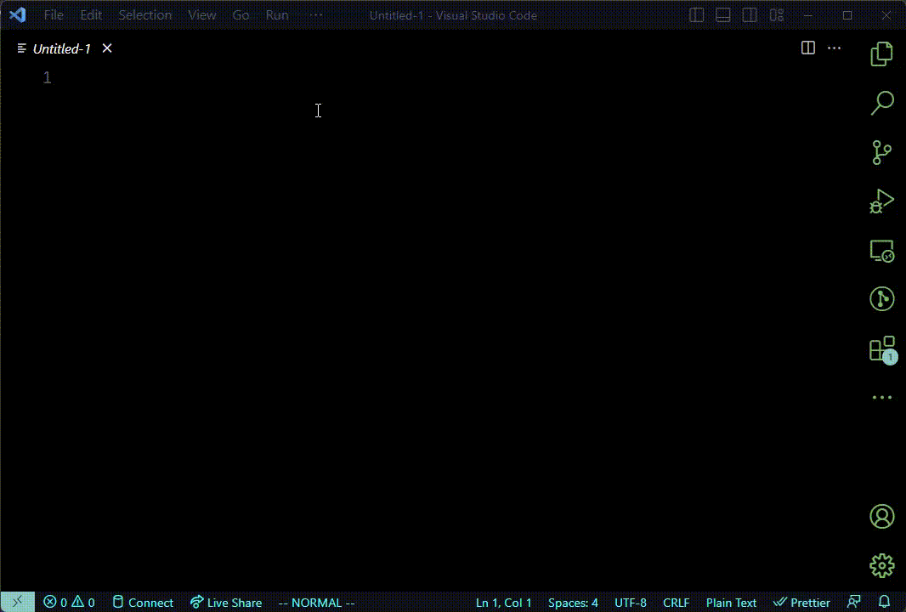
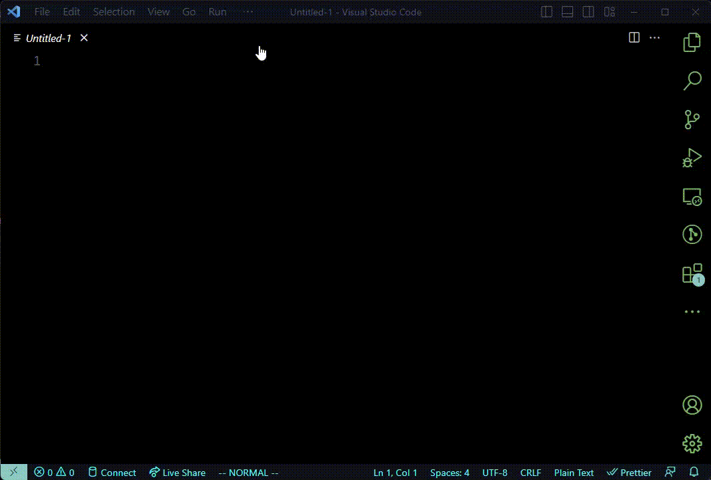
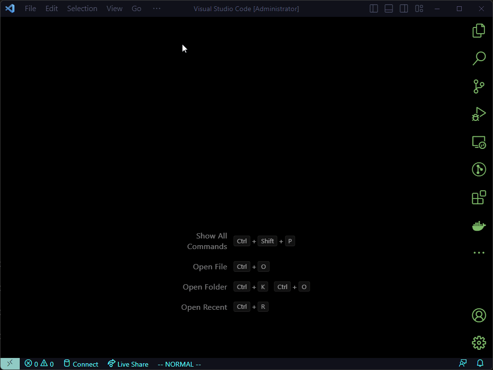
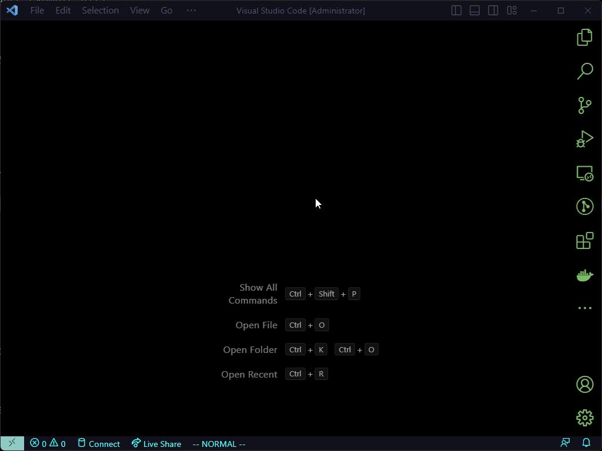
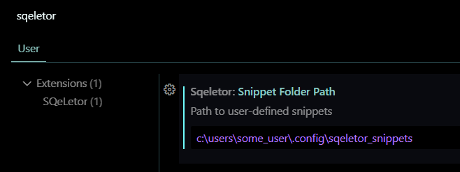

# sqeletor-vscode README

An opinionated SQL template

## Features

SQeLetor procedure



SQeLetor script



SQeLetor snippets



SQeLetor user-defined snippets



## Installation

Download from VSIX from [Releases](https://github.com/groovyghoul/sqeletor.vscode/releases).

Install in VS Code via the Extensions manager using "Install from VSIX...". 

## Setup/Configuration

To configure where user-defined snippets are stored



For each user-defined snippet, create a file in the configured folder using the convention:

key.txt 

For example:

1. Create a file and name it `my_action.txt`
2. Edit file with the following

```
key=my_action
label=This is the label that will show in menu
---
select *
from some_table;
```

## Development

### Download source code

```shell
git clone https://github.com/groovyghoul/sqeletor.vscode.git
```

### To compile

```shell
npm run compile
```

## Release Notes

### 0.0.3

feat: add snippets and user-defined snippets

### 0.0.2

fix: focus inside of the window when new tabs are created

### 0.0.1

Initial release of sqeletor-vscode (alpha)

---

### TODO

* decide what snippets should be shipped with extension and clean up

### Known Issues

* the cursor is not pre-positioned in the desired location for "SQeLetor procedure". It works correctly for "SQeLetor script", though
